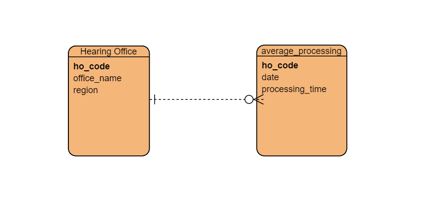

# Router API

### A Restfiul API Router (for education) 
###### This is for demonstration purposes only.
A routing API provides a means for routing API request intended for API servers. 
 

#### I. Router
The "router" is use to control which type of HTTP requested(GET/PUT/DELETE/POST/etc) is allowable.

## Built With 
   * [Maven](https://maven.apache.org/) - Dependency Management
        
 
 ## Database
     
   * [MYSQL](https://www.mysql.com/) - Database Schema
        
    Example: Entity-relationshp-Diagram
   
        
        
        
        
        
 
        
        
## Acknowledgement
